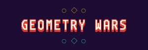

# Geometry Wars Sample

This sample demonstrates how to use the SimplyECS framework to create a Geometry Wars-inspired game.



## Overview

Geometry Wars is a classic twin-stick shooter with simple but engaging gameplay. This sample implements:

- Player movement and shooting
- Enemy spawning and AI behavior
- Collision detection and response
- Particle effects
- Game states (menu, play, game over)
- Simple score tracking

## How to Run

```bash
# From the project root directory
mkdir build && cd build
cmake ..
cmake --build .
cd bin
./geometry_wars
```

## Controls

- **WASD** - Move the player
- **Mouse** - Aim
- **Left Mouse Button** - Shoot
- **Space** - Activate sonar wave (pushes enemies away)
- **P** - Pause/unpause the game
- **Escape** - Quit to menu/game over

## Implementation Details

### Game Structure

- The game uses a state machine to manage different game states (menu, play, game over)
- The ECS framework handles entities, components, and systems
- SFML is used for rendering, input, and window management

### Components

The game uses various components to define entity behavior:

#### Components
- **TransformComponent** - Position, rotation, and scale in 2D space
- **VelocityComponent** - Movement velocity vector and maximum speed
- **ShapeComponent** - Visual appearance (shape type, color, radius, points)
- **CollisionComponent** - Collision detection radius
- **PlayerComponent** - Tags entity as player character
- **EnemyComponent** - Tags entity as standard enemy
- **AdvancedEnemyComponent** - Enhanced enemy with bullet evasion capabilities
- **BulletComponent** - Tags entity as projectile
- **ParticleComponent** - Tags entity as visual effect particle
- **HealthComponent** - Current and maximum health points
- **HealthChangeComponent** - Pending health modifications (damage/healing)
- **ScoreComponent** - Tracks player score
- **InputComponent** - Marks entities that respond to user input
- **TagComponent** - Generic type identification (PLAYER, ENEMY, BULLET, etc.)
- **LifespanComponent** - Automatic entity destruction after time limit
- **GlowComponent** - Pulsating color effect around entities
- **LightAuraComponent** - Colored light aura with animation
- **WeaponComponent** - Defines which weapons an entity possesses
- **GunComponent** - Bullet-firing weapon configuration
- **SonarWeaponComponent** - Sonar wave weapon configuration
- **SoundWaveComponent** - Active sound wave effect properties

### Systems

The gameplay is separated into various systems:

- **InputSystem** - Processes keyboard and mouse input for player control
- **PlayerSpawnSystem** - Handles player entity creation and initialization
- **MovementSystem** - Updates entity positions based on velocities
- **BoundarySystem** - Prevents entities from leaving the screen boundaries
- **CollisionSystem** - Detects collisions between entities using radius checks
- **CollisionResponseSystem** - Handles reactions to collisions (damage, knockback, etc.)
- **EnemySpawnSystem** - Creates new enemies over time with varied attributes
- **AdvancedEnemySystem** - Controls intelligent enemy behavior, including bullet avoidance
- **HealthSystem** - Manages entity health, damage, and death
- **LifespanSystem** - Handles time-limited entities and their expiration
- **WeaponSystem** - Manages weapon cooldowns and firing
- **ScoreSystem** - Tracks and updates player score
- **RenderSystem** - Draws entities to the screen with proper transformations
- **ParticleSystem** - Creates and manages particle effects for explosions and visual feedback

### Events

The systems communicate through events:

- **CollisionEvent** - Emitted when two entities collide (containing both entity IDs)
- **FireBulletEvent** - Emitted when player requests bullet firing (with target coordinates)
- **SonarAttackEvent** - Emitted when player activates sonar wave ability
- **SpawnEnemyEvent** - Emitted to request creation of a new enemy
- **ScoredEvent** - Emitted when player earns points
- **SpawnPlayerEvent** - Emitted to request player creation
- **PlayerSpawnedEvent** - Emitted when player entity is successfully created
- **PlayerDeadEvent** - Emitted when player dies (game over condition)
- **SpawnEnemyParticlesEvent** - Emitted when enemy takes damage (for visual feedback)
- **BulletDamagedEvent** - Emitted when a bullet damages an entity

## Architecture

The game demonstrates the separation of concerns and component-based design principles of ECS:

- Entities are composed of specific components for their roles
- Systems handle specific gameplay aspects
- Events provide loose coupling between systems
- The state machine manages high-level game flow

## Configuration

The game is configurable through a JSON file located at `resources/config.json`. This file controls:

- Window parameters
- Player attributes
- Enemy attributes and spawning
- Weapon properties
- Visual effects

## Extensions

The game can be extended in several ways:

- Add new enemy types
- Implement power-ups
- Add new weapons
- Create new game modes
- Enhance visual effects

## License

This sample is licensed under the MIT License - see the [LICENSE](../../LICENSE) file in the main project directory for details.